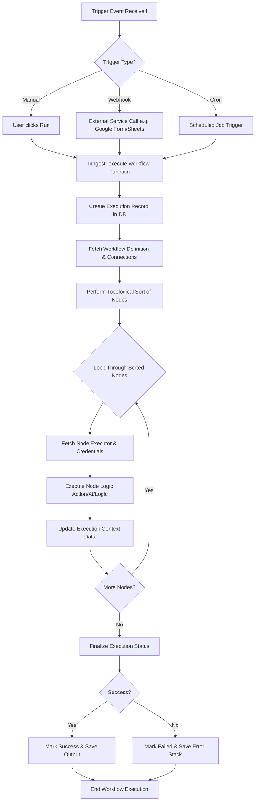
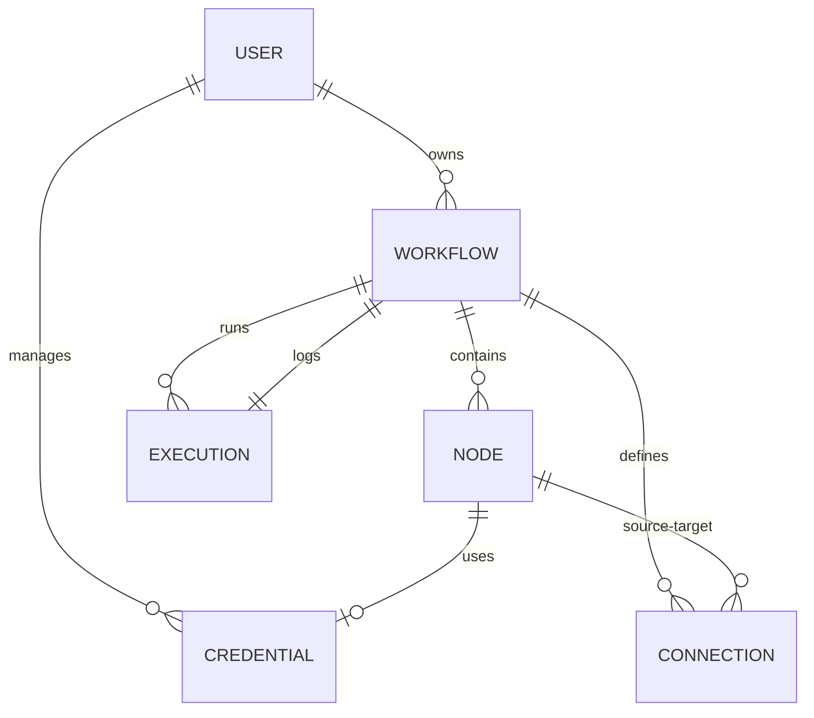

# Project Architecture and Workflow Diagrams

This document outlines the process flow and use case diagrams for the **3X3CUT0R (executor)** project, a workflow automation platform.

## 1. Process Flow Diagram (Workflow Execution)

This diagram illustrates the lifecycle of a workflow execution, from the initial trigger to the final status update. It highlights the role of Inngest and the sequential node execution logic.



## 2. Use Case Diagram

This diagram captures the main interactions between the **End User** and the **System**, as well as the system's interaction with **External APIs**.

```mermaid
graph LR
    subgraph Users
        User((End User))
    end

    subgraph "3X3CUT0R Platform"
        UC1(Manage Account)
        UC2(Create/Edit Workflow)
        UC3(Configure Node Data)
        UC4(Manage API Credentials)
        UC5(Trigger Workflow Manually)
        UC6(Monitor Execution Logs)
        UC7(Configure Google Sheets/Apify)
    end

    subgraph "External Systems"
        ES1(External APIs e.g., Notion, Resend, Apify)
        ES2(Trigger Sources e.g., Google Forms, Google Sheets)
    end

    User --> UC1
    User --> UC2
    User --> UC3
    User --> UC4
    User --> UC5
    User --> UC6
    User --> UC7

    UC3 -.-> UC4 : "Uses credentials"
    UC2 --> UC3 : "Add nodes"
    
    ES2 -- "Webhook/Polling" --> UC5
    UC3 -- "API Call" --> ES1
```

## 3. Workflow Data Model (ER)

A high-level view of the relationship between core entities in the database.



---

### Key Workflow Features
- **Topological Sorting**: Correctly orders nodes based on their dependencies (Connections).
- **Execution Context**: A shared data object that carries results from one node to the next.
- **Resilient Execution**: Managed by Inngest, allowing for retries and failure handling.
- **Node Registry**: A modular system for adding new types of integrations (AI, Social Media, Databases).
