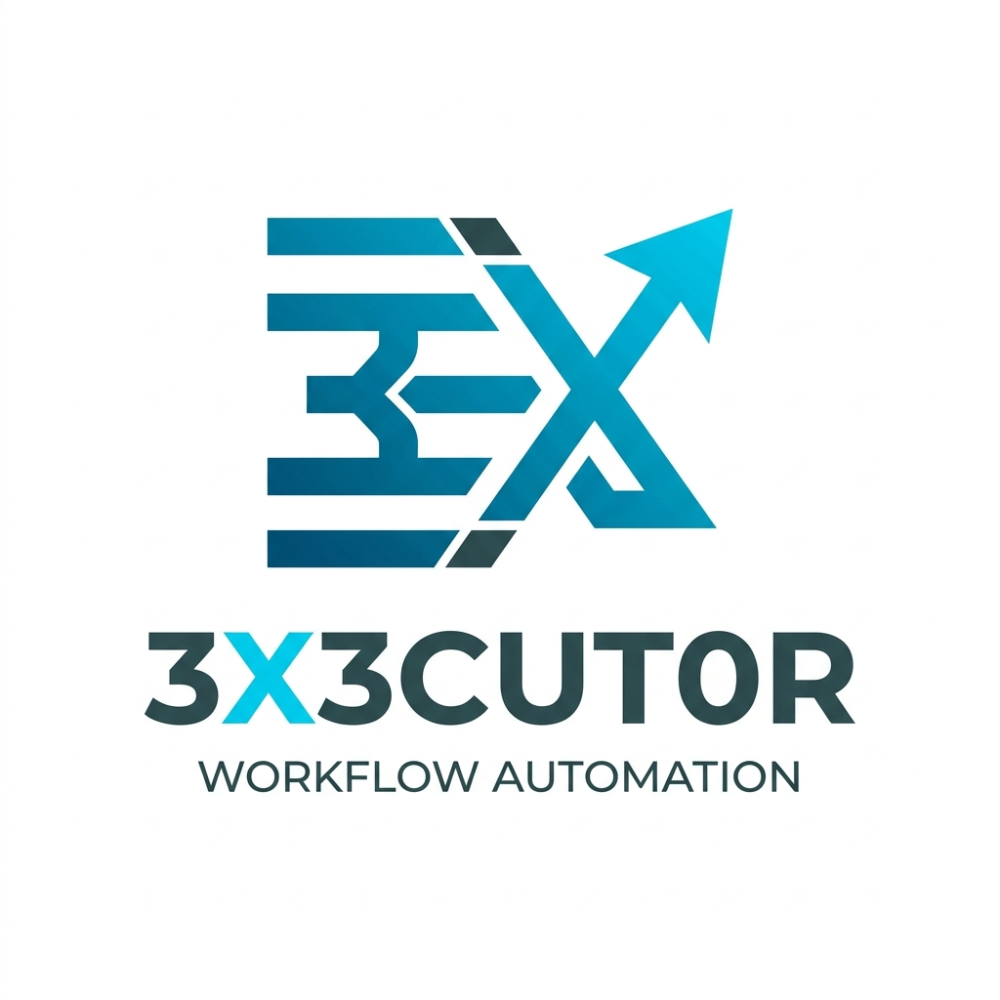
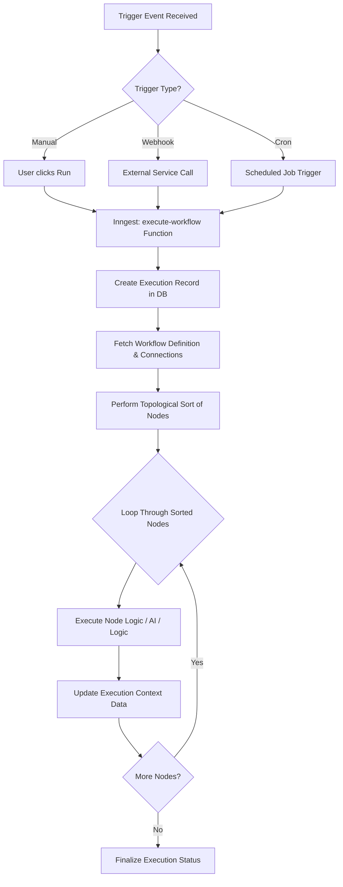

<div align="center">
  

  # 3X3CUT0R (EXECUTOR)

  **A High-Performance, AI-Powered Workflow Automation Platform.**

  [](https://nextjs.org/)
  [](https://www.typescriptlang.org/)
  [](https://www.prisma.io/)
  [](https://www.inngest.com/)
  [](https://tailwindcss.com/)

  [Landing Page](https://3x3cut0r.vercel.app) • [Documentation](CONFIGURATION_GUIDE.md) • [Report Bug](https://github.com/Mansur00015/3X3CUT0R/issues)
</div>

---

## 🚀 Overview

**3X3CUT0R** is a modern, enterprise-grade workflow automation engine designed to bridge the gap between complex logic and visual design. It allows users to build, manage, and execute sophisticated automation pipelines through an intuitive, node-based visual editor.

Whether it's automating lead generation with AI, orchestrating multi-platform social media posts, or managing complex human-in-the-loop approvals, **3X3CUT0R** provides a resilient and scalable foundation for all your automation needs.

### ✨ Key Features

- **🎨 Visual Workflow Builder**: A powerful drag-and-drop interface powered by **React Flow**, featuring custom nodes for triggers, actions, and logic.
- **🤖 Multi-Model AI Orchestration**: Seamlessly integrate with **Gemini 2.0**, **GPT-4o**, and **Claude 3.5** for intelligent task execution and content generation.
- **⚡ Real-Time Execution Tracking**: Monitor your workflows as they run with live status updates and detailed execution logs via **Inngest Realtime**.
- **🔗 15+ Native Integrations**:
  - **Triggers**: Webhooks, Cron Schedules, Google Forms, Stripe, Google Sheets.
  - **Actions**: Notion, WhatsApp, Resend (Email), X (Twitter), Reddit, Discord, Slack.
  - **Logic**: Conditions, Delays, Data Transformation.
- **🤝 Human-in-the-Loop**: Built-in **Human Approval** nodes to pause executions until a manual decision is made, perfect for sensitive workflows.
- **🛡️ Secure Credential Management**: Encrypted storage for API keys and OAuth tokens using enterprise-grade encryption.
- **📈 Scalable Infrastructure**: Built on **Inngest**, ensuring workflows are durable, retriable, and capable of handling high concurrency.

---

## 🛠️ Tech Stack

### Frontend
- **Framework**: [Next.js 15 (App Router)](https://nextjs.org/)
- **Visual Editor**: [@xyflow/react (React Flow)](https://reactflow.dev/)
- **Styling**: [Tailwind CSS 4](https://tailwindcss.com/) & [Radix UI](https://www.radix-ui.com/)
- **State Management**: [Jotai](https://jotai.org/) & [TanStack Query](https://tanstack.com/query/latest)
- **Forms**: [React Hook Form](https://react-hook-form.com/) + [Zod](https://zod.dev/)

### Backend & Orchestration
- **Runtime**: Node.js
- **Orchestration**: [Inngest](https://www.inngest.com/) (Durable Functions)
- **Database**: [PostgreSQL](https://www.postgresql.org/) via [Prisma ORM](https://www.prisma.io/)
- **Authentication**: [Better Auth](https://better-auth.com/)
- **API**: [tRPC](https://trpc.io/) for end-to-end typesafety

### AI & Services
- **AI SDK**: [Vercel AI SDK](https://sdk.vercel.ai/)
- **Providers**: Google Gemini, Anthropic Claude, OpenAI GPT
- **Monitoring**: [Sentry](https://sentry.io/)

---

## 📐 Architecture

3X3CUT0R uses a **Topological Sorting** algorithm to determine the correct execution order of nodes based on their dependencies. The execution context is passed between nodes, allowing for dynamic data flow.



---

## 🚦 Getting Started

### Prerequisites
- Node.js 20+
- PostgreSQL Database
- Inngest Account (for production)

### Installation

1. **Clone the repository:**
   ```bash
   git clone https://github.com/Mansur00015/3X3CUT0R.git
   cd 3X3CUT0R
   ```

2. **Install dependencies:**
   ```bash
   npm install
   ```

3. **Set up Environment Variables:**
   Copy `.env.example` to `.env` and fill in the required values.
   ```bash
   cp .env.example .env
   ```

4. **Initialize Database:**
   ```bash
   npx prisma db push
   ```

5. **Run the Development Suite:**
   This command starts the Next.js app, Inngest dev server, and Ngrok (if configured) simultaneously using `mprocs`.
   ```bash
   npm run dev:all
   ```

---

## ⚙️ Environment Configuration

| Key | Description |
| :--- | :--- |
| `DATABASE_URL` | PostgreSQL connection string. |
| `ENCRYPTION_KEY` | 32-character key for encrypting credentials. |
| `INNGEST_EVENT_KEY` | Key for sending events to Inngest (Production). |
| `BETTER_AUTH_SECRET` | Secret for authentication encryption. |
| `NEXT_PUBLIC_APP_URL` | The base URL of your application. |

*For a full list of integration-specific keys, see the [Configuration Guide](CONFIGURATION_GUIDE.md).*

---

## 📁 Project Structure

```text
├── src/
│   ├── app/            # Next.js App Router (Pages & APIs)
│   ├── components/     # UI Components (Radix, Shadcn)
│   ├── hooks/          # Custom React Hooks
│   ├── lib/            # Shared utilities & Client instances
│   ├── server/         # tRPC Procedures & Backend Logic
│   ├── workflows/      # Workflow Node Registry & Logic
│   └── store/          # Jotai Atoms for global state
├── prisma/             # Database Schema
├── public/             # Static Assets
└── inngest/            # Workflow Orchestration Functions
```

---

## 📄 License

This project is licensed under the MIT License - see the [LICENSE](LICENSE) file for details.

---

<div align="center">
  Built with ❤️ by [Aman (Mansur)](https://github.com/Mansur00015)
</div>
